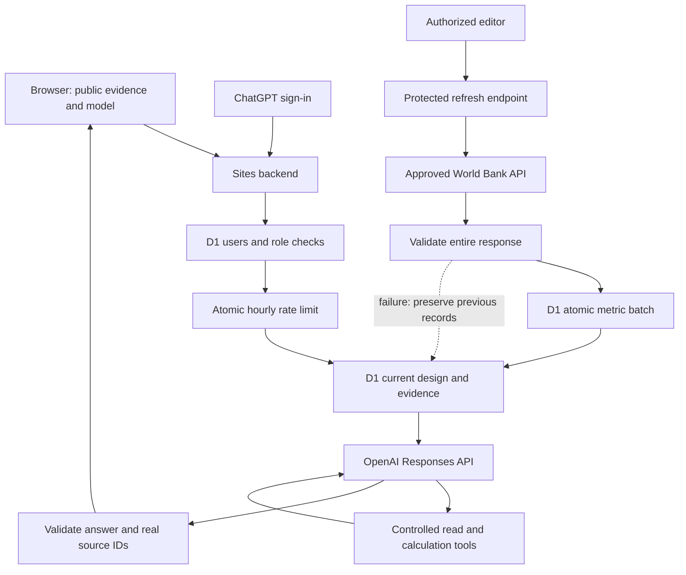

# Application architecture

Eight tables: users, countries, sources, metrics, designs, design_claims, events, rate_limits. D1 migration lives in `drizzle/`. Seeding uses an atomic idempotent batch and does not rewrite saved designs. Startup never modifies the schema.

All mutation endpoints check same origin and identity. Registration cannot assign roles. The configured `ADMIN_USER_IDS` allowlist bootstraps an administrator without making the first registrant an administrator. Further role changes require admin. The local mock identity only belongs to loopback preview and is not a production account.

The site was initially private and is now public by explicit owner instruction. Signed-out visitors can inspect the design and download the submission package. AI still requires authenticated registration; editing and refresh still require authorization. GitHub remains private.

Engineering concept claims C11-C19 persist separately from the editable numeric model. Every adviser request includes deterministic full-load power/energy; every displayed answer includes the saved PUE, facility MW and annual GWh calculated on the server.
